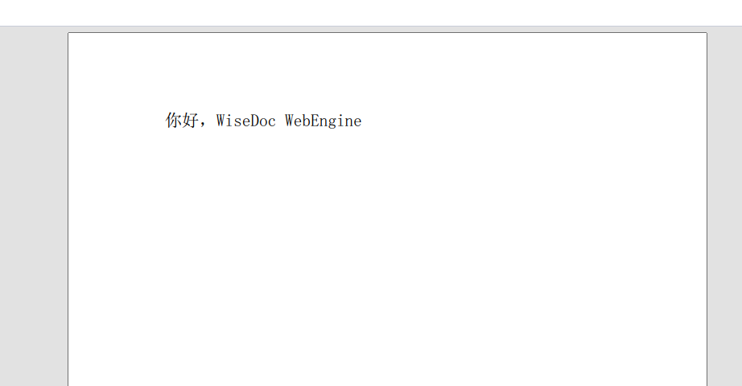

<p align="center">
	
</p>
<h1 align="center" style="margin: 30px 0 30px; font-weight: bold;">wdwe</h1>
<h4 align="center">基于B/S架构的文档处理引擎</h4>
<p align="center">
	<a href="https://gitee.com/wisii/wdwe/stargazers"></a>
	<a href="https://gitee.com/wisii/wdwe"></a>
</p>

在使用wdwe前，请务必悉知 [***《wdwe免责声明》***](免责声明.md)！

## 项目简介
- 官网地址：[https://www.wisii.com](https://www.wisii.com)
- 演示地址：[https://wisprint.cn](https://wisprint.cn)
- 文档地址：[https://www.wisii.com/doc](https://www.wisii.com/doc)


wdwe(WiseDoc WebEngine)基于APACHE FOP，是一套B/S架构的Web处理引擎，功能是将用户数据与单据模板解析合成，在客户端展现、编辑、实时打印。可以与应用系统部署在一起，也可以作为独立服务器单独部署。wdwe通过浏览器接受用户处理请求，准备相关的数据和模板，进行合成解析，将结果通过网络传送到客户端，供操作员查看、打印，也可以对文档数据域进行编辑，并将编辑后的信息传送到后台。wdwe也提供数据处理功能，提供其他数据源和XML之间相互转换的功能，提供数据库、CSV、固定长度txt转换成XML数据，以及XML数据输出到关系数据库、转换成CSV文件、txt文件的功能，同时提供XML数据结构转换，统计计算等功能。

* 基本 B/S 架构设计开发，能与用户的核心系统集成在一起；
* 用户通过客户端浏览器直接查看文档并打印，也可对文档数据域进行编辑，并将编辑后的信息传送到后台；
* 用户可在打印前预览，并可以对某些数据域进行编辑，并将编辑后的信息打印输出；
* 能导出生成 PDF、OFD、PCL、PS、TIF、JPG、RTF 等各种电子文档；
* 开放的打印机支持，客户端可以按照 Windows 的操作方式选择本地打印机，或是选择只有 ip 地址和端口的网络打印机，不限定打印机品牌；
* 模板格式遵循 W3C 国际开放标准 Xslt V2.0；
* 支持套打（将内容打印到带有表格的纸张上）实现方式，对于同一个单据可以选择套打，也可以不选择套打而完全打印；并且可以按照纸张的需要，动态调整套打的输出位置，使得套打精准；同时对于已经调整过的套打位置参数，可以实时保存在每一个独立的客户端，以帮助用户在下次打印不用再次调整输出位置。
* 客户端不需要安装部署，就可以直接打印单据；
* 支持 xml 数据格式；
* 支持数据库数据格式；
* 支持连续纸打印参数调节；
* 能够适应多客户端同时操作打印作业；
* 可以控制客户端对打印内容的转存，以保证单据的安全性
* 可以限定客户端对同一个单据只能打印一次
* 支持中国特色的复杂表格
* 支持导出OFD(中国自主研发的电子文件版式文档格式)
* 支持导出HTML


#### 使用说明

示例项目：github([https://github.com/wisii_eng/wdwe-demo](https://github.com/wisii_eng/wdwe-demo))，gitee([https://gitee.com/wisii/wdwe-demo](https://gitee.com/wisii/wdwe-demo))

**wdwe 将持续保证API的向下兼容，您可以放心的升级wdwe库至最新版本。**

> - 若您没有采用Maven管理项目，请参阅项目中`pom.xml`文件中的依赖，手动解决三方依赖包问题。
> - 若出现NoClassFound等错误，请检查相关包是否存在冲突。

Maven项目引入依赖
```xml
<dependency>
  <groupId>com.wisii</groupId>
  <artifactId>wdwe-core</artifactId>
  <version>2.0.1</version>
</dependency>
<dependency>
  <groupId>com.wisii</groupId>
  <artifactId>wdwe-fonttool</artifactId>
  <version>2.0.1</version>
</dependency>
```

生成一份PDF文档示例

```java
public class HelloWorld {
    public static void main(String[] args) throws IOException {
      Path xslPath = Paths.get("src/test/resources","hello.xsl");
      Path xmlPath = Paths.get("src/test/resources","hello.xml");
      Path outPath = Paths.get("target/hello.pdf").toAbsolutePath();
      WisiiBean bean = new WisiiBean();
      try {
        bean.setOutputMode(MimeConstants.MIME_PDF);
        bean.setOutputfilename(outPath.toString());
        bean.setXslFile(xslPath.toFile());
        bean.setXmlFile(xmlPath.toFile());
        WDWEUtil.renderTo(bean);
        System.out.println("生成文档位置: " + outPath.toAbsolutePath());
      } catch (Exception e) {
        e.printStackTrace();
      }
    }
}
```

效果如下：



### 推荐使用《wdtd表单设计器》生成XSL模板，下载地址：[https://www.wisii.com/wp-content/download/designer.zip](https://www.wisii.com/wp-content/download/designer.zip)
wdtd表单设计器是一款支持动态数据、所见即所得、跨平台、具有丰富样式效果的表单设计器。
wdtd表单设计器开源地址：github([https://github.com/wisii_eng/wdtd](https://github.com/wisii_eng/wdtd))，gitee([https://gitee.com/wisii/wdtd](https://gitee.com/wisii/wdtd))
#### 参与贡献

1.  Fork 本仓库
2.  新建 Feat_xxx 分支
3.  提交代码
4.  新建 Pull Request

#### 社区交流

- QQ群：579148691